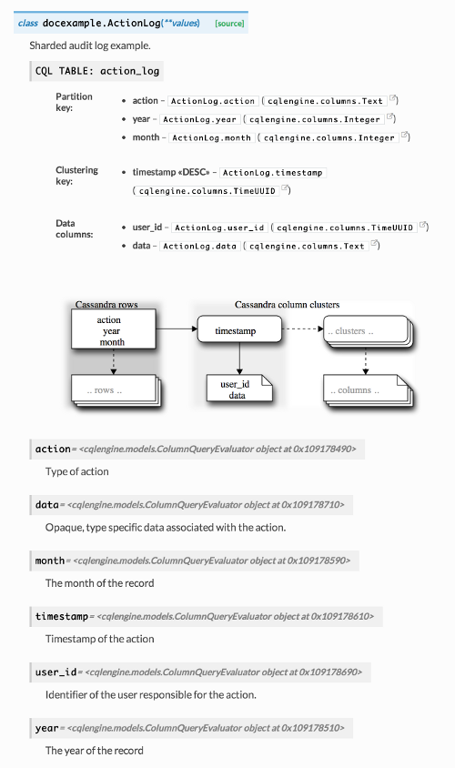

=======================
sphinxcontrib-cqlengine
=======================

This package provides an extension for the `Sphinx <http://sphinx-doc.org/>`_
documentation system for automatically generating documentation for
`cqlengine <https://cqlengine.readthedocs.org>`_, a Python ORM for the
`Cassandra <http://cassandra.apache.org/>`_ database.

The extension depends on and compliments the
`autodoc <http://sphinx-doc.org/ext/autodoc.html#module-sphinx.ext.autodoc>`_
and `sphinxcontrib-blockdiag <http://blockdiag.com/en/blockdiag/sphinxcontrib.html>`_
extensions.

Installation
============

Add `sphinxcontrib-cqlengine` to your package dependencies or install it
separately::

    pip install sphinxcontrib-cqlengine

Enable the required Sphinx extensions in `conf.py`:

.. code-block:: python

    extensions = [
        # Intersphinx for linking directly into the cqlengine documentation
        'sphinx.ext.intersphinx',
        'sphinx.ext.autodoc',
        # blockdiag for rendering the diagrams
        'sphinxcontrib.blockdiag',
        'sphinxcontrib.cqlengine',
    ]

For linking directly into the cqlengine documentation update the intersphinx
mapping:

.. code-block:: python

    intersphinx_mapping = {
        'http://docs.python.org/': None,
        'cqlengine': ('https://cqlengine.readthedocs.org/en/latest', None),
    }

Usage
=====

The extension provides a single new directive called `cassandra` which takes a
single argument which is the module path to the cqlengine model to document::

    .. cassandra:: path.to.model

Example
=======

.. code-block:: python

    from cqlengine.models import model
    from cqlengine import columns

    class ActionLog(Model):
        """Sharded action log

        .. cassandra:: myapp.models.AuditLog
        """
        #: Type of action
        action = columns.Text(primary_key=True, partition_key=True)

        #: The year of the record
        year = columns.Integer(primary_key=True, partition_key=True)

        #: The month of the record
        month = columns.Integer(primary_key=True, partition_key=True)

        #: Timestamp of the action
        timestamp = columns.TimeUUID(primary_key=True, default=uuid.uuid1, clustering_order='DESC')

        #: Identifier of the user responsible for the action.
        user_id = columns.TimeUUID()

        #: Opaque, type specific data associated with the action.
        data = columns.Text()

Produces output similar to the following (depending on the Sphinx theme used).
The generated documentation includes the name of the CQL table generated by the
model and lists the model attributes grouped into three sections:

    * the partition key (possibly composite)
    * the clustering key (possibly multi-part)
    * the data columns

Each attribute has internal links to the per-attribute documentation (if
generated by Sphinx) and the corresponding documentation of the used cqlengine
column type (if intersphinx is activated).

The generated block-diagram shows the logical structure of the model in terms
of rows (partitions) and (possibly) clustered column groups.

